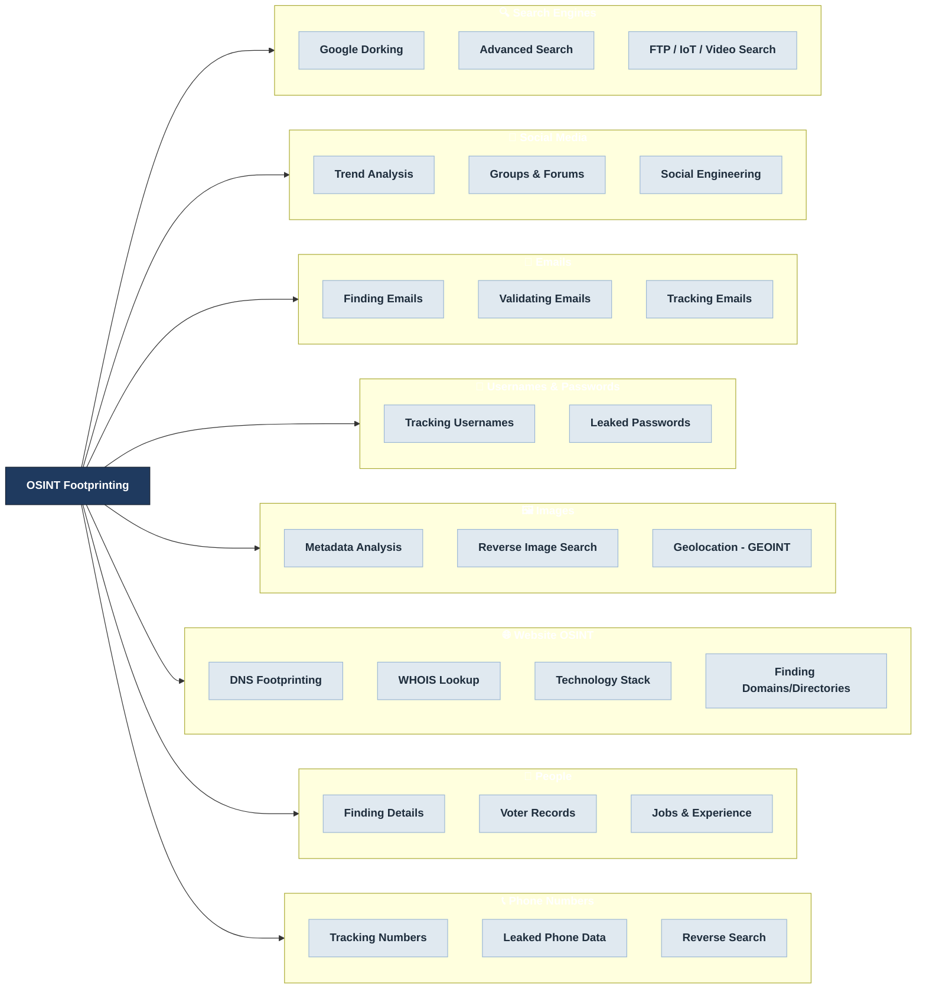
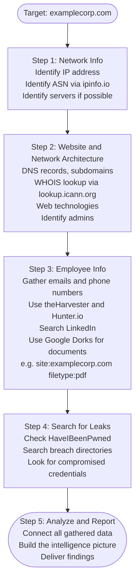

# Practical OSINT: The Complete Handbook for Beginners

---

# Chapter 1: Introduction to Open Source Intelligence

---

## 1.1 Welcome to the World of OSINT

What if you could find almost anything about anyone, any organization, or any digital asset, using nothing but publicly available information and the right set of skills? That is not a fantasy. It is the reality of Open Source Intelligence, and it is exactly what this handbook will teach you.

The internet is a vast ocean of information. Most people swim on the surface, using search engines for basic queries and scrolling through social media without a second thought. But beneath that surface lies an enormous, largely untapped world of publicly accessible data. Learning to navigate that world is one of the most valuable skills you can develop in the modern age.

Every single day, people and organizations leave behind a massive digital footprint. Every social media post, every username registration, every forum comment, every photo upload, and every business listing adds another breadcrumb to a trail that a trained investigator can follow. The clues are everywhere. The difference between an ordinary internet user and an OSINT analyst is knowing where to look, how to connect what you find, and how to do it all while protecting your own identity.

This handbook will take you from complete beginner to confident OSINT practitioner. By the time you finish, you will know how to:

- Build a professional investigation environment using Kali Linux, including cloud-based setups
- Create untraceable online personas, known as sock puppets, for safe research
- Master advanced searching techniques including Google Dorking and AI-assisted queries
- Find email addresses, usernames, and breached credentials
- Explore massive leaked databases from platforms like Facebook, Twitter, and LinkedIn
- Track phone numbers back to their owners using open source methods
- Scrape social media platforms for critical intelligence
- Pinpoint the exact location where a photograph was taken using geolocation techniques
- Uncover hidden subdomains and historical data about any website
- Find exposed IoT devices and live cameras using tools like Shodan
- Master the art of operational anonymity using private VPNs and privacy-first workflows

No prior experience is required. This handbook is designed to meet you where you are and build your skills progressively, one layer at a time.

---

## 1.2 What Is OSINT?

Let us start at the very beginning.

**Open Source Intelligence (OSINT)** is the practice of collecting and analyzing information gathered from publicly available or open sources. The critical word in that definition is _open_. OSINT is not about hacking into private servers, exploiting software vulnerabilities, or stealing confidential data. It is about being exceptionally skilled at finding, connecting, and interpreting information that is already out there, visible to anyone who knows how and where to look.

The term "open source" in this context has nothing to do with open source software. It simply means that the sources of information are publicly accessible rather than classified or restricted.

OSINT is used across an impressive range of professional fields:

| Field                                 | How OSINT Is Used                                                                    |
| ------------------------------------- | ------------------------------------------------------------------------------------ |
| Cybersecurity and Ethical Hacking     | Reconnaissance before penetration tests, attack surface mapping, threat intelligence |
| Journalism and Investigative Research | Source verification, uncovering hidden details, building evidence for stories        |
| Law Enforcement and Intelligence      | Criminal investigations, tracking suspects, locating missing persons                 |
| Corporate Security                    | Competitive intelligence, due diligence, insider threat investigations               |
| Human Resources                       | Background research on candidates, verifying professional histories                  |
| Personal Privacy                      | Understanding your own digital footprint and learning to reduce it                   |

OSINT is often described as a superpower, and that description is well-earned. For cybersecurity professionals, it is a non-negotiable skill. Reconnaissance, which is the systematic gathering of information about a target before any action is taken, is the critical first phase of any ethical hacking engagement. The more you know about a target before you begin, the more focused, efficient, and successful your work will be.

For journalists and researchers, OSINT allows you to verify sources independently, uncover details that subjects might prefer to keep quiet, and add layers of depth and credibility to your reporting. For businesses, it enables competitive intelligence and risk management. And for everyone, understanding OSINT is fundamentally about digital literacy. When you understand how easily information about you can be found and pieced together, you begin to see your own online presence through a very different set of eyes. That awareness is the first step toward protecting your own privacy.

---

## 1.3 The Ethics of OSINT: A Line You Must Never Cross

Before we go any further into techniques and tools, we need to have an honest and direct conversation about ethics. This is not a formality. It is one of the most important sections in this entire handbook.

OSINT is a powerful capability, and like all powerful capabilities, it can be used responsibly or irresponsibly. This handbook is built entirely around responsible, ethical, and legal use. The moment you cross the ethical line, you are no longer practicing OSINT. You are committing a crime.

The most fundamental ethical distinction in OSINT is the difference between **passive reconnaissance** and **active reconnaissance**.

### Passive Reconnaissance (OSINT)

Passive reconnaissance involves gathering information about a target without directly touching, probing, or interacting with their systems. You are working entirely from the outside, observing information that has already been made publicly available through various channels.

Examples of passive reconnaissance include:

- Running Google searches about a person or organization
- Browsing publicly accessible social media profiles
- Checking public records databases
- Using services like Shodan or Censys, which have already gathered their own data independently
- Reviewing historical website snapshots on archive services

Passive reconnaissance is generally legal and safe, provided you are handling the information you find in an ethical and lawful manner. This is the entire focus of this handbook.

### Active Reconnaissance (NOT OSINT)

Active reconnaissance involves directly probing a target's systems to gather information. This means sending packets to their servers, running port scans, probing firewalls, or using vulnerability scanners against systems you do not own or have explicit permission to test.

Examples of active reconnaissance include:

- Port scanning with tools like Nmap
- Running web vulnerability scanners against a target's infrastructure
- Actively probing firewalls or network perimeters

Active reconnaissance is not OSINT. It can be illegal without explicit written permission from the target organization. It can be interpreted as the beginning of a cyberattack. Do not, under any circumstances, perform active reconnaissance against systems you do not own or have documented, written authorization to test.

The table below summarizes this distinction clearly:

| Aspect       | Passive Reconnaissance (OSINT)                                        | Active Reconnaissance (NOT OSINT)                               |
| ------------ | --------------------------------------------------------------------- | --------------------------------------------------------------- |
| Our focus?   | Yes, this is what we do                                               | No, we avoid this entirely                                      |
| Method       | Gathering info without touching target systems                        | Directly probing target systems for a response                  |
| Examples     | Google searches, social media browsing, public record lookups, Shodan | Port scanning (Nmap), vulnerability scanners, probing firewalls |
| Legal status | Generally legal and safe                                              | Can be ILLEGAL without explicit written permission              |
| Risk         | Low when done responsibly                                             | Can be treated as a cyberattack                                 |

> **Critical Warning:** Never perform active reconnaissance against any target you do not have explicit, written permission to test. This course trains intelligence analysts, not criminals. The legal consequences of unauthorized system probing can be severe.

### Additional Ethical Principles

Beyond the passive versus active distinction, responsible OSINT practitioners follow a broader set of ethical principles:

1. **Purpose matters.** Gathering publicly available information to support a legitimate investigation, security assessment, or research project is very different from gathering it to stalk, harass, or harm someone.

2. **Just because you _can_ find something does not mean you _should_ use it.** Not every piece of information you uncover needs to be reported, shared, or acted upon.

3. **Handle sensitive data carefully.** If your investigation uncovers personal data about individuals who are not the actual target of your inquiry, treat that information with discretion.

4. **Understand the laws in your jurisdiction.** Privacy laws vary significantly by country and region. Always ensure your activities comply with applicable law.

---

## 1.4 What Can We Actually Find? The Digital Breadcrumbs

One of the first questions new OSINT practitioners ask is: what kind of information can really be found through open sources? The honest answer is far more than most people expect.

The categories of information available through OSINT fall into four broad areas:

### Organization Information

When investigating a company or institution, you can often uncover:

- Employee names and job titles
- Corporate email address formats
- Office phone numbers and physical locations
- The internal technology stack the organization uses (programming languages, frameworks, content management systems)
- Organizational structure and reporting hierarchies

### Network Information

The digital infrastructure of an organization often reveals:

- IP address ranges associated with the organization
- Domain and subdomain names
- Hosting providers and content delivery networks
- DNS records (which can reveal mail servers, cloud services, and more)
- Autonomous System Numbers (ASNs), which identify the organization's internet routing presence

### System Information

Going deeper into the technical layer, OSINT can reveal:

- Web server types and software versions
- Publicly exposed login panels or administrative interfaces
- Usernames visible in page source code, metadata, or error messages
- Services running on publicly accessible ports (discovered via services like Shodan)

### Personal Intelligence

When the focus of an investigation is an individual, open sources can yield:

- Social media profiles across multiple platforms
- Family connections and relationship networks
- Location history inferred from geotagged photographs
- Personal email addresses and phone numbers
- Evidence of past data breaches, including compromised passwords

---

## 1.5 The OSINT Landscape: A Map of the Territory

OSINT is not a single technique or a single tool. It is an entire discipline made up of many different investigative paths. The process of systematically mapping out a target's digital presence is called **footprinting**, and it spans a remarkably wide range of domains.

Think of the following diagram as your map for the journey ahead. Each branch represents a different area of investigation that we will explore in this handbook.

Do not worry about memorizing all of this right now. Each branch of this map will be explored in detail throughout the handbook. What matters at this stage is understanding the sheer breadth of the discipline. OSINT is not a single trick. It is a structured, methodical approach to gathering and connecting information across many different domains.

---

## 1.6 The OSINT Mindset: Think Like an Analyst

Tools and techniques are important. But what separates a truly effective OSINT practitioner from someone who just runs a few searches is mindset.

The OSINT mindset is built on three qualities:

**Curiosity.** Every piece of information you find raises new questions. A name leads to an email address. An email address leads to a username. A username leads to a forum profile from ten years ago. A curious investigator never stops at the first layer.

**Creativity.** The information you are looking for is rarely labeled and sitting in an obvious place. Effective OSINT requires thinking sideways, approaching a problem from unexpected angles, and using tools and sources in ways that were never originally intended.

**Relentlessness.** Investigations rarely succeed on the first try. Sources go offline. Searches return irrelevant results. Dead ends are part of the process. The best OSINT practitioners are those who keep methodically working through the puzzle, even when progress is slow.

When you look at a piece of information, do not just see what it is. Ask what it could lead to. A company's job posting, for example, is not just a recruitment advertisement. It reveals the technologies the company uses, the team structure, the hiring manager's name, and clues about internal projects. A single photograph posted to social media is not just an image. It may contain embedded GPS coordinates, reveal the model of camera used, or show a location that can be identified through background details.

This habit of extracting maximum intelligence from every piece of data is what defines the OSINT mindset.

---

## 1.7 A Basic OSINT Workflow in Action

Let us put theory into practice with a real-world example of how an OSINT investigation might unfold. Imagine that our target is a fictional organization called **examplecorp.com**. Perhaps we are a security professional conducting an authorized penetration test, and we need to build as complete a picture as possible before we begin.

Here is how a structured OSINT workflow would look:

Let us walk through each step in detail.

**Step 1: Network Information**
The first task is to understand the target's network presence. Using a tool like IPinfo (ipinfo.io), you can look up the organization's IP address range and their Autonomous System Number (ASN). The ASN tells you which internet service provider or hosting company the organization uses, which is useful context for the rest of your investigation. If possible, you would also try to identify specific servers associated with the domain.

**Step 2: Website and Network Architecture**
Next, you go deeper into the target's digital infrastructure. A WHOIS lookup, using a service like lookup.icann.org, reveals who registered the domain, when it was registered, and sometimes contact details for the registrant. You would also enumerate subdomains (which can reveal development environments, admin portals, and internal tools), examine DNS records, and use browser extensions or online tools to identify the web technologies the target is running.

**Step 3: Employee Information**
Now the investigation shifts from infrastructure to people. Tools like theHarvester and Hunter.io are used to gather employee email addresses and identify the email naming convention the organization uses (for example, firstname.lastname@examplecorp.com). LinkedIn is an invaluable resource for identifying employee names, roles, and professional histories. Google Dorks, which are advanced search queries, can be used to find publicly accessible documents hosted on the target's domain, such as PDFs that may contain employee names, internal project details, or sensitive information.

**Step 4: Search for Leaks**
This is one of the most revealing steps. Using services like HaveIBeenPwned and various breach data directories, you check whether any of the email addresses you have discovered have been compromised in past data breaches. If they have, the associated breach data may include usernames, hashed or plaintext passwords, and other personal details that significantly expand your intelligence picture.

**Step 5: Analyze and Report**
The final step is synthesis. All the scattered pieces of information gathered across the previous four steps are brought together to form a coherent intelligence picture. Individual data points that seemed insignificant on their own often become highly meaningful when connected to other findings. This analysis forms the basis of your report, whether that is a penetration test summary, a journalistic investigation, or a security briefing.

This five-step workflow is a foundation that you will return to again and again throughout your OSINT career. The specific tools and techniques in each step will evolve and expand as you develop your skills, but the underlying structure remains consistent.

---

## 1.8 Chapter Summary

Let us consolidate everything covered in this first chapter.

- **OSINT stands for Open Source Intelligence.** It is the practice of collecting and analyzing information from publicly available sources.

- **OSINT is used across many fields**, including cybersecurity, journalism, law enforcement, corporate security, and personal privacy.

- **The ethical foundation of OSINT is the distinction between passive and active reconnaissance.** Passive reconnaissance, which is our entire focus, involves gathering publicly available information without touching or probing target systems. Active reconnaissance involves directly interacting with target systems and can be illegal without explicit written permission.

- **The types of information accessible through OSINT** span four main categories: organization information, network information, system information, and personal intelligence.

- **Footprinting** is the process of systematically mapping a target's digital presence across all these categories.

- **The OSINT mindset** is characterized by curiosity, creativity, and relentlessness. It is about seeing not just what a piece of information is, but what it could lead to.

- **A structured OSINT workflow** moves from network information to website architecture, then to employee data, then to breach data, and finally to analysis and reporting.

---

> **What Comes Next**
>
> In the next chapter, we dive into what many experienced practitioners consider the single most powerful OSINT technique available to beginners and professionals alike: advanced searching with Google, including the art of Google Dorking. You will be surprised by how much is hiding in plain sight, waiting to be found by someone who knows the right search operators to use.

---

_End of Chapter 1_
